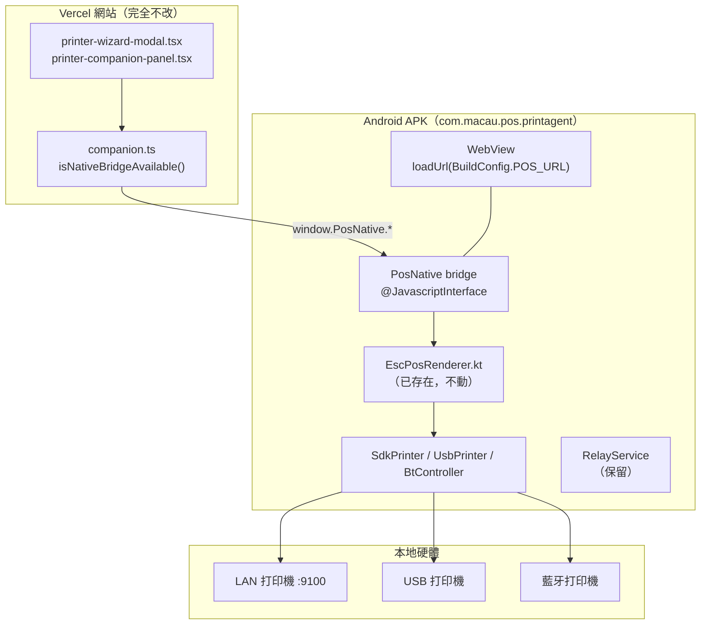

# Desktop Companion 架構說明 + Android APK 移植方案

> 2026-09-17 · macauPosAndroid
> 目的：先講清 `C:\dev\desktop-companion` 現在**實際點運作**（尤其 setup 流程同介面來源），
> 再據此規劃 Android APK 的移植方案。
>
> **限制（用戶明令）**
> 1. 目標平台是 **Android 平板 / 點餐機**（如美團點餐機），**不是手機**。
> 2. **Setup page 必須保留**，用法同 desktop 一致 —— **所有 setup 都在 website 端完成**，介面沿用 website 那邊的。
> 3. **Website 端完全不需修改**。
> 4. **原本的 printerhub 方法已不再使用，直接從程式碼刪除，不需要保留或提醒。**

---

## 第一部分：desktop-companion 現在的架構

### 1.1 一句話總結

**`desktop-companion` 的 exe 裡面完全沒有 setup 介面。**

它是一個三件套：

| 元件 | 職責 | 佔比 |
|---|---|---|
| **Electron 殼**（`electron/main.js`） | 開一個 kiosk 全屏視窗，`loadURL(POS_URL)` 載 **Vercel 上的網站** | 「瀏覽器」 |
| **Companion 伺服器**（`companion-server.mjs`） | 只綁 loopback 的 HTTP agent（`:9311`），提供 7 個查詢/執行端點，代瀏覽器去碰 USB / LAN / 藍牙 | 「手腳」 |
| **更新器**（`electron-updater` + `preload.cjs`） | 版本查詢 / 下載 / 安裝 | 「保養」 |

商家眼睛看到的、手指按到的**每一格 UI 都是網站畫的**。exe 只是「一個打不開網址列的瀏覽器 + 一雙能碰到硬體的手」。

---

### 1.2 為什麼要這樣拆？—— 瀏覽器沙盒碰不到硬體

這是整個設計的**唯一理由**：

```
Vercel 網站（HTTPS，瀏覽器沙盒）
        │
        │  ✗ 瀏覽器 JS 不可以：
        │    · 開 raw TCP socket 去 192.168.1.50:9100
        │    · 直接 claim USB interface 做 bulkTransfer
        │    · 開藍牙 SPP serial port
        │
        │  ✓ 但可以 fetch http://127.0.0.1:9311
        │    （loopback 是瀏覽器認可的 secure context，
        │      HTTPS → loopback HTTP 不算 mixed content）
        ↓
Companion 伺服器（本機 Node，無沙盒限制）
        │
        ├─→ LAN TCP :9100（raw ESC/POS bytes）
        ├─→ USB bulk transfer（node-usb）
        └─→ 藍牙 SPP（serialport）
```

**所以 exe 的存在價值 = 把「網站碰不到硬體」這個物理限制補上。** 這個邏輯在 Android 上一模一樣，只是「補限制的角色」由 `window.PosNative` 這個 in-process bridge 擔任（見 §2.2）。

---

### 1.3 啟動流程（`electron/main.js`，261 行）

```js
app.whenReady()
  → setupAutoUpdater()        // autoDownload=false, autoInstallOnAppQuit=true
  → startCompanionServer()    // 起 :9311（127.0.0.1 + ::1 兩個獨立 server 實例）
  → createWindow()            // kiosk = !(process.env.KIOSK === "0")
  → createTray()              // 托盤：顯示 / 檢查更新 / 退出
  → registerAdminShortcuts()  // Ctrl+Shift+Q 退出
  → setTimeout(checkForUpdates, 3000)
```

`createWindow()` 的關鍵幾行：

```js
const POS_URL = process.env.DESKTOP_POS_URL || "https://macau-pos-system.vercel.app";
new BrowserWindow({
  kiosk,                                    // 無邊框全屏
  webPreferences: {
    contextIsolation: true,                 // 網站 JS 碰不到 Node
    nodeIntegration: false,
    sandbox: false,
    preload: preload.cjs,
  },
});
win.loadURL(POS_URL);
win.webContents.on("did-fail-load", ...);   // 重試 6 次 × 600ms（門店斷網時白屏 → 自動重連）
win.on("close", (e) => { e.preventDefault(); win.hide(); });  // 撳 X 不退出，只隱藏
app.on("window-all-closed", (e) => e.preventDefault());        // keep alive
```

> **重點：`win.loadURL(POS_URL)` —— 網頁不落 exe。**
> `main.js` 的註釋原話：「網頁唔落 exe → 更新只 push Vercel，唔使重打包」。
> 這正是「setup 在 website 端」的機制來源：**根本沒有第二個 setup 介面存在**。

---

### 1.4 `companionShell` preload —— 完全沒有打印能力

`electron/preload.cjs`（35 行）全文暴露的能力：

```js
contextBridge.exposeInMainWorld("companionShell", {
  openExternal,      // 外部連結
  quit,              // 退出
  getVersion,        // 版本號
  checkUpdate,       // 檢查更新
  downloadUpdate,    // 下載更新
  quitAndInstall,    // 安裝並重啟
  onUpdateStatus,    // 更新狀態回調
});
```

**沒有一個字跟打印有關。** `companionShell` 的存在只是：

1. 給網站一個訊號 —— 「我在 Desktop 殼裡面」（`shouldUseCompanionChannel()` 會檢查 `window.companionShell` 是否存在）；
2. 讓網站能顯示版本號、觸發更新。

**打印能力的唯一入口是 `http://127.0.0.1:9311`，走 HTTP，不走 preload。**

> 對照 Android：`PosNative` bridge **本身就是打印能力**（`printJob` / `testPrint` / USB / BT 都在裡面）。
> 這是兩者最大的結構差異 —— desktop 是「HTTP loopback」，Android 是「in-process bridge」，
> **但對 website 而言兩者的角色相同：都是一雙能碰硬體的手。**

---

### 1.5 Companion 伺服器：7 個端點，零 UI

`companion-server.mjs`（1232 行）只綁 loopback：

```js
const hosts = ["127.0.0.1", "::1"];   // 兩個獨立 server 實例，不是同一實例雙綁
```

| 端點 | 方法 | 用途 | POS 側呼叫端 |
|---|---|---|---|
| `/api/health` | GET | 回 `{ ok: true, version }` | `probeCompanion()` / `isCompanionAvailable(true)` |
| `/api/config` | GET | 回 `{ companionUrl, posUrl, tokenEnabled }` | `tryAutoPairCompanion()` 自動配對 |
| `/api/discover` | GET | mDNS 掃 `_printer._tcp` / `_escpos._tcp` / `_pdl-datastream._tcp` | `discoverCompanionLanPrinters()` |
| `/api/usb` | GET | node-usb 枚舉，回型號表解析結果 | `enumerateCompanionUsbPrinters()` |
| `/api/bluetooth` | GET | `serialport.list()` | `enumerateCompanionBluetoothDevices()` |
| `/api/probe-lan` | POST | TCP 試連 `ip:port`（timeout 3000ms） | `probeLan(ip, 9100)` |
| `/api/print` | POST | **執行打印** | `sendJobToCompanion(job, printer)` |
| `/api/printers` | GET | LAN + USB 合併清單 | `listCompanionPrinters()` |

**全都是「查詢」或「執行」，沒有一個回 HTML 介面**（`GET /` 甚至是 404）。

> ⚠️ 注意 `statusPageHtml()` / `electron/status.html` 是**另一個東西**：
> 那是 exe 自帶的**除錯狀態頁**（顯示 `ok / version`，每 2500ms 刷新），
> 只有開發者手動開 `http://127.0.0.1:9311` 才看到，網站不依賴它。

---

### 1.6 Setup 流程真相 —— 介面 100% 在 website

#### 1.6.1 網站側的 Setup UI（唯一真實介面）

| 檔案 | 行數 | 角色 |
|---|---|---|
| `printer-wizard-modal.tsx` | ~36 KB | **3 步新增打印機精靈** |
| `printer-companion-panel.tsx` | 646 行 | **狀態卡 + 自動偵測 + 裝置清單** |
| `printer-test-print.ts` | 137 行 | 測試列印（**不經 Hub**） |

**`printer-wizard-modal.tsx` 三步：**

| 步 | 內容 | 資料來源 |
|---|---|---|
| ① | 選**用途**（`zone` 廚房機 / `receipt` 小票機 / `label` 標籤機）+ 選**連線方式**（`lan` / `usb`） | 靜態 `roleOptions` / `connOptions` |
| ② | 掃描並列出可選裝置 | `scanUsb()` → `/api/usb`；`scanLan()` → `/api/discover` |
| ③ | 確認型號 / IP / 紙寬 / 語系，寫入設定 | `complete()` → 落 `DevicePrinterConfig` |

**`scanUsb()` 是關鍵（L213-232）：**

```ts
const available = await isCompanionAvailable(true);          // ← 走 /api/health
if (!available) { setState(s => ({...s, usbScanning: false})); return; }
const candidates = await enumerateCompanionUsbPrinters();    // ← 走 /api/usb
```

**`selectUsbDevice(candidate)` 直接消費 Companion 回的型號欄位（L275-305）：**

```ts
const family      = candidate.family ?? (labelish ? "label" : "receipt");
const isLabel     = family === "label";
const opt = {
  brand:        candidate.model || "USB 打印機",
  model:        candidate.model || candidate.name || "USB 打印機",
  charset:      candidate.charset        || (isLabel ? "utf-8" : "gb18030"),
  paperSize:    candidate.paperSize      || (isLabel ? "100x75mm" : "80mm"),
  kanjiEnlarge: candidate.kanjiEnlarge   || "GS!",
  family, alsoKnownAs: [],
};
```

#### 1.6.2 完整 Setup 時序

```
① 開發者把 exe 裝到店內 PC，雙擊
       ↓
② exe 起 :9311，開 kiosk 視窗 loadURL(https://macau-pos-system.vercel.app)
       ↓
③ 網站 mount → tryAutoPairCompanion()
       · window.companionShell 存在 → shouldAutoDiscoverCompanion() = true
       · fetch("http://127.0.0.1:9311/api/config") → 拿到 companionUrl
       · 寫入 localStorage["macau-pos-companion-url"] = "http://127.0.0.1:9311"
       ↓
④ 商家在網站上打開「打印機設定」→ 按「新增打印機」
       ↓
⑤ wizard 三步：選用途/連線 → 掃描（/api/usb 或 /api/discover）→ 確認
       ↓
⑥ complete() → 設定寫入 Supabase（DevicePrinterConfig，以 storeId 分組）
       ↓
⑦ 之後每次打印：
   網站 dispatchJobToNative() → fetch :9311/api/print {job, printer}
       → companion-server renderEscPos(job, printer) → 傳輸 → 出紙
```

**全程沒有出現過任何由 exe 提供的 UI。**

---

### 1.7 逐項回答：`setup.html` / `remote.html` / `index.html` 的實際角色

**結論：三個都不是 website 的介面。它們是 `printerhub`（舊 Printer Hub）自帶的獨立頁面，而且是死資產。**

#### 它們的來源

這三個檔案位於 `app/src/main/assets/`，是 **Android APK 內嵌的本地網頁**，由 `LanHttpServer`（`hub` 套件）在 `:8787` 上伺服：

```kotlin
// hub/LanHttpServer.kt route()
"/"           → assets/setup.html
"/setup.html" → assets/setup.html
"/setup"      → assets/setup.html
"/remote.html"→ assets/setup.html   // ← 連 remote.html 本身都指去 setup.html
```

它們的**設計用途**是：中繼機（Sunmi APK）開一個 `:8787` 的網頁給**同一個 LAN 網段的裝置**開去打打印機設定 —— 這是 `printerhub` 時代「IP:8787 配對」那套。

#### 為什麼是死資產

| 證據 | 出處 |
|---|---|
| `remote.html` 被 route 表指去 `setup.html`，**自身永不被伺服** | `LanHttpServer.kt` L79-110 |
| POS 側 `hub.ts` 頭部註釋：「**舊 Printer Hub adapter 已於 2026-08 移除，見 docs/50**」 | `src/lib/print-bridge/hub.ts` L1-17 |
| 「已移除 `applyPairText()`。它解析 `IP:8787` 配對地址…**該 APK 端檔案亦已同步刪除，見 print-relay v1.1.5**」 | `hub.ts` L11-16 |
| 「該通道要求網頁同中繼機**同一個 LAN 網段**才打得到，但 **iPad 根本打不到**（`127.0.0.1` 是 iPad 自己），Android 平板亦已有更好的 PosNative 直印；結果設計目標同 relay 重疊，且**全 repo 零呼叫端**（從未接通）」 | `hub.ts` L11-16 |
| `print-relay` v1.1.5 **已刪掉整套 Hub HTTP 伺服器，`assets/` 目錄整個消失** | `C:\dev\print-relay\` |
| `desktop-companion/README.md` L154：「Printer Hub（Sunmi APK）**❌ 已於 2026-08 移除**（docs/50 P0），統一經 Companion / native bridge / relay」 | `README.md` |
| `setup.html` 的 `returnUrl` 指向一個 **GitHub Pages demo 站**，不是任何真實環境 | `assets/setup.html` L93 |

#### 判定

| 檔案 | 角色 | 處置 |
|---|---|---|
| `assets/setup.html` | printerhub 時代的獨立設定頁。**不是** website 的介面，與「setup 在 website 端」的架構目標直接衝突 | 🔴 **刪除** |
| `assets/remote.html` | 死資產，route 表已把它丟棄，自身永不被伺服 | 🔴 **刪除** |
| `assets/index.html` | `<title>POS Printer Demo</title>`，用 `PosNative.getPairQrDataUrl()` 顯示配對 QR。**同樣是 printerhub 配對流程的產物** | 🔴 **刪除** |

> **Android 為什麼根本不需要這些頁？**
> 因為 **Android 用的是 in-process bridge，不是 HTTP**。`window.PosNative` 在網頁載入後立即可用，
> `isNativeBridgeAvailable()` 一句話就知道「我在 Android 殼裡」，
> **完全不存在 desktop 那種「要先知道 :9311 在哪」的問題** —— 所以配對頁、QR 頁、設定頁全部沒有存在理由。
> 用戶的直覺完全正確：「這些 html 應該都不是用來顯示介面的」。

---

### 1.8 三種傳輸的實作（移植要對齊的部分）

#### LAN（`printLan`）

```js
const sock = net.connect(printer.lanPort || 9100, printer.ipAddress);
sock.write(buf);
setTimeout(() => sock.end(), 300);   // ⚠️ 關鍵：300ms 後才 end()
sock.setTimeout(5000);
```

> 註釋原話：「大單會 missing print」—— 寫完即刻 `end()` 會截斷大單。
> **Android 側 `EscPosPrinter.printRaw` 只用 `Thread.sleep(150)`**，且是在 socket 關閉**之後**才睡。
> 這是移植時要對齊的一個行為差異。

#### USB（`printUsb`，node-usb）

```js
findByIds(vid, pid)
  → 優先 bInterfaceClass === 7 的 interface
  → 否則第一個 OUT bulk endpoint
  → isKernelDriverActive() && detachKernelDriver()
  → claim() → outEp.transfer(buf)
```

Android 有 `net/UsbPrinter.kt`（native USB Host API），邏輯**已經對齊**：
- ✓ 優先 `interfaceClass == USB_CLASS_PRINTER`，fallback `getInterface(0)`
- ✓ 找 `USB_ENDPOINT_XFER_BULK` + `USB_DIR_OUT`
- ✓ 分塊寫（8 KB）
- ⚠️ 但 `isPrinterDevice()` 的過濾太嚴（見 §2.4 缺口 ③）

#### USB Printer Class（`printUsbClass`，Windows USB001 虛擬埠）

```js
// Windows
spawnSync("cmd", ["/c", "print", `/D:${port}`, tmp]);
// macOS / Linux
lp -o raw -d port tmp
```

**Android 沒有也不需要這條** —— Android 平板不會有 Windows 列印佇列。

#### 藍牙（`printBluetooth`）

```js
resolveBtPort(printer)   // 從 bluetoothName 抽 COM3 / \\.\ / /dev/cu.*，否則 serialport.list() 模糊匹配
  → new SerialPort({ path, baudRate, autoOpen: false })
  → open → write → drain → close
```

Android 用 `bt/BtController.kt` + `BtPrinter.kt`（SPP pairing）。macOS 的 `/dev/cu.*` 字串在 Android 上**不可能存在** → `resolveBtPort` 那套直接丟棄，改按 MAC 位址配對。

---

### 1.9 跨三端同源合約（渲染）

```
web          src/lib/escpos-render.ts       renderEscPosLines()
desktop      companion-server.mjs           renderEscPos()
Android      net/EscPosRenderer.kt          renderTemplateTicket() 等 4 個入口
```

三者必須同源。**`node test-crossrepo-parity.mjs`** 會掃描比對。

| 合約 | 內容 |
|---|---|
| 紙寬 | `template.cols` 由 POS `buildSnapshot()` 算好（58mm→32 / 80mm→48）。Android **只做 fallback，不自己判** |
| 放大指令 | `ESC !` = bit（s=0x00/m=0x20/l=0x30）<br>`GS !` = nibble（s=0x00/m=0x01/l=0x11）<br>`FS !` = bit（s=0x00/m=0x04/l=0x0C） |
| 每行清零 | **每行開頭必須 `clearMagnify()`**（`GS !` + `ESC !` + `FS !` 三套歸零）<br>`GS !`/`FS !` 是打印機常駐狀態，`ESC !` 清不走 → 純 ASCII 分格線變雙闊 → 一條線變兩條 |
| 分格線 | 放大時 dash 數量要減半（`dashLine()`） |
| 抬頭表 | `receipt` = `＊＊＊ 收據 ＊＊＊` / `label` = **空字串**（刻意不印）/ `kitchen` = `＊＊＊ 廚房 ＊＊＊` / `shift` = 無（由模板 `header` 自帶） |
| QR | `GS v 0` 點陣圖，**不用 `GS ( k`**（舊機/平價機不支援）。點陣由 POS 端 encode，三倉共用同一矩陣 |
| 折扣副線 | `ESC { 1` 反白 |

**Android 的 `EscPosRenderer.kt`（555 行 / 29 KB）已經完整實現以上全部** —— 這是整個移植案**唯一不需要重做的部分**，它是資產而非負債。

---

## 第二部分：Android 移植方案

### 2.1 移植的目標架構



**關鍵：Android 的 `PosNative` 就是 desktop 的 `companion-server.mjs` 的對應物。**
兩者要提供**同一組能力**給網站 —— 差別只在傳輸方式（in-process bridge vs HTTP loopback）。

---

### 2.2 端點 ↔ Bridge 方法對照表

這是移植的核心對照。**左邊是 desktop 提供給網站的能力，右邊是 Android 的實現狀態。**

| # | desktop 端點 / 能力 | POS 側呼叫端 | Android 對應 Bridge 方法 | 狀態 |
|---|---|---|---|---|
| 1 | `GET /api/health` | `probeCompanion()`<br/>`isCompanionAvailable(true)` | **（無）** | 🔴 **必須新增** |
| 2 | `GET /api/config` | `tryAutoPairCompanion()` | **（不需要）** | ✅ 免 —— Android 靠 `isNativeBridgeAvailable()` 判定 |
| 3 | `GET /api/usb` | `enumerateCompanionUsbPrinters()` | `listUsbPrinters` | 🟡 **存在但欄位不足**（見 §2.4 ①） |
| 4 | `GET /api/discover` | `discoverCompanionLanPrinters()` | `listDevices`（Hub，待刪） | 🔴 **需重做為 mDNS / 子網掃描** |
| 5 | `GET /api/bluetooth` | `enumerateCompanionBluetoothDevices()` | `listBtPrinters` | ✅ 大致可用 |
| 6 | `POST /api/probe-lan` | `probeLan(ip, 9100)` | **（無）** | 🔴 **必須新增** |
| 7 | `POST /api/print` | `sendJobToCompanion()`<br/>`dispatchJobToNative()` | `printJob` / `testPrint` | ✅ 已可用 |
| 8 | `GET /api/printers` | `listCompanionPrinters()` | **（無）** | 🟡 可選 |

---

### 2.3 刪除清單（printerhub 全套，用戶明令不留）

#### 2.3.1 整個檔案刪除

| 檔案 | 大小 | 說明 |
|---|---|---|
| `app/src/main/java/.../hub/PrinterHub.kt` | 9138 B | Hub 核心，含 `PORT = 8787` |
| `app/src/main/java/.../hub/LanHttpServer.kt` | 20998 B | `:8787` HTTP 伺服器（523 行），runtime 用 `ServerSocket` 起，**不要動 `net/LanScanner.kt`** |
| `app/src/main/java/.../hub/PrintHubService.kt` | 3881 B | Hub 前台服務 |
| `app/src/main/java/.../hub/PairQr.kt` | 1483 B | 配對 QR 產生器 |
| `app/src/main/assets/setup.html` | 7937 B | printerhub 設定頁 |
| `app/src/main/assets/remote.html` | 6182 B | **死資產** |
| `app/src/main/assets/index.html` | 6158 B | POS Printer Demo 配對頁 |

刪完 `hub/` 資料夾整個空掉 → 一併刪資料夾。

#### 2.3.2 `MainActivity.kt` 內的 Hub 痕跡

**imports（刪）：**
```kotlin
import com.macau.pos.printagent.hub.PairQr
import com.macau.pos.printagent.hub.PrintHubService
import com.macau.pos.printagent.hub.PrinterHub
import com.macau.pos.printagent.net.LanScanner   // ⚠️ 見下方說明
```

**欄位（刪）：**
```kotlin
private lateinit var scanner: LanScanner
private lateinit var hub: PrinterHub
```

**`setup()` 內（刪）：**
```kotlin
hub = PrinterHub.get(this)
scanner = LanScanner(this)
runCatching { PrintHubService.start(this) }
hub.webCommandListener = PrinterHub.WebCommandListener { ... }
```

**方法（刪）：**
```kotlin
fun loadPrinterSettings()   // file:///android_asset/index.html
fun backToPos()
private fun resolvePrinterFromHub(job: PrintJobDto): PrinterCfgDto?
```

**`onDestroy` 內（刪）：** `::hub` 的 guard

**`Bridge` 內 13 個 @JavascriptInterface 方法（刪）：**

| 方法 | 行號 | 用途 |
|---|---|---|
| `listDevices` | L321-324 | Hub 裝置清單 |
| `getBootstrapJson` | L385-398 | Hub 啟動資料 |
| `getPairQrDataUrl` | L401-405 | 配對 QR |
| `detectSubnet` | L408 | 子網前綴 |
| `detectLocalIp` | L411 | 本機 IP |
| `startScan` | L414-416 | 觸發 Hub 掃描 |
| `addManual` | L419-426 | 手動加裝置 |
| `assignService` | L429-434 | 綁定服務 |
| `removeDevice` | L437-442 | 移除裝置 |
| `clearAll` | L445-450 | 清空 |
| `printService` | L453-460 | **Hub 旁路打印**（不同源！） |
| `openPrinterSettings` | L373-375 | 開設定頁 |
| `backToPos` | L379-381 | 回首頁 |

**保留的 10 個（打印主路）：**

`printJob` / `testPrint` / `openRelay` / `getRelayStatus` / `listUsbPrinters` / `requestUsbPermission` / `listBtPrinters` / `scanBtPrinters` / `stopBtScan` / `requestBtPermission`

**`getStatus()`（L278-288）需改寫**：目前依賴 `scanner.detectLocalIpv4()` + `hub`，刪 Hub 後改為回 USB/BT 計數與 relay 狀態。

#### 2.3.3 `AndroidManifest.xml`

```xml
<!-- 刪：L77-84 -->
<service android:name=".hub.PrintHubService"
         android:foregroundServiceType="specialUse">
  <property android:name="android.app.PROPERTY_SPECIAL_USE_FGS_SUBTYPE"
            android:value="LAN HTTP print hub for offline POS printing" />
</service>
```

**注意：`FOREGROUND_SERVICE_SPECIAL_USE` 權限要保留** —— `relay.RelayService` 也用 `specialUse`。

#### 2.3.4 `net/LanScanner.kt` 的處置（⚠️ 不要整個刪）

`LanScanner` 有兩個用途被分開：

| 方法 | 目前用途 | 處置 |
|---|---|---|
| `detectLocalIpv4()` | `PrinterHub.localIp()` + `getStatus()` | **保留**（改寫 `getStatus()` 後可能仍需顯示本機 IP） |
| `detectSubnetPrefix()` | `PrinterHub.subnetPrefix()` | 可保留作 LAN 掃描用 |
| `scanSubnet(prefix, ports, timeoutMs, onProgress)` | Hub 掃描 | **改造為 `/api/discover` 的等價物**（見 §2.4 ④） |
| `probeIp(ip, ports, timeoutMs)` | `PrinterHub.addManualBlocking` | **改造為 `probeLan` 的實現**（見 §2.4 ⑥） |
| `lookupMac(ip)` | scanSubnet 附帶 | 保留（掃描結果顯示用） |

**所以 `LanScanner` 是資產，不是 Hub 的一部分。** 它只是「碰巧被 Hub 用了」，把 Hub 刪掉後它可以轉職去服務 LAN 發現與探測。

#### 2.3.5 `net/EscPosPrinter.kt` 的處置

`EscPosPrinter` 有兩個部分：

| 部分 | 用戶 | 處置 |
|---|---|---|
| `printRaw(ip, port, payload, timeoutMs)` | `SdkPrinter.printBytes`（LAN raw） | ✅ **保留** —— 這是主路的 LAN 傳輸 |
| `probe(ip, port, timeoutMs)` | 目前無人用 | ✅ **保留** —— 可作 `probeLan` 的實現 |
| `printTextTicket(ip, title, body, footer)` | 只有 `PrinterHub.printTargets` / `printIdentify` | 🔴 **刪除** |
| `buildTicket(title, body, footer)` | 同上（固定 32 個 `-`、硬編 UTF-8、無兩欄/折扣/QR） | 🔴 **刪除** |

> `SdkPrinter.kt` L63 的註釋說「EscPosPrinter 同時俾 PrinterHub 用，所以唔改做 object」——
> Hub 刪掉後可以順手改成 `object`，但**非必要**，不急。

---

### 2.4 需新增 / 修補的缺口（10 項）

#### ① USB 候選欄位不足（最關鍵的功能缺陷）—— 而且網站側也在丟

**這是一個「兩層同時丟資料」的問題，兩層都要修（但只改 Android 那一層）。**

**第 1 層 —— 網站側 `native.ts` 只 map 4 個欄位（🔴 新發現，比 Android 側的缺失更早截斷）：**

`src/lib/print-bridge/native.ts` L160-180 `listNativeUsbPrinters()`：

```ts
return list.map((raw) => {
  const p = raw as { vendorId?: number; productId?: number; label?: string; name?: string; productName?: string };
  return {
    source: "usb",
    name: p.label || p.productName || p.name || `USB 打印機 ${nativeHexId(p.vendorId)}`,
    connectionType: "usb",
    usbVendorId:  nativeHexId(p.vendorId),
    usbProductId: nativeHexId(p.productId),
  } as PrinterCandidate;      // ← 只回 4 個欄位，其餘全部丟棄
});
```

對照 desktop 那條路（`companion.ts` L569-600 `enumerateCompanionUsbPrinters()`）**有完整 map**：
`model` / `charset` / `paperSize` / `kanjiEnlarge` / `family` / `maxLabelWidthMm` / `minLabelWidthMm`。

**→ 就算 Android 側把 6 個欄位都吐出來，網站側這個 mapper 也會把它們丟掉。**

⚠️ **但用戶明令「網站部分完全不需修改」** —— 所以這裡有個**必須澄清的矛盾**，
見 §3 決策點 D5。（`native.ts` 是 website 檔案，不改的話 ①②③ 都無法真正生效。）

**第 2 層 —— Android 側 `UsbPrinterCandidate` 只有 8 個欄位：**

`model/UsbPrinterCandidate.kt`（81 行）只有：
```
vendorId / productId / deviceName? / productName? / serialNumber? / key / brandLabel / hasPermission
```

`toJson()` 輸出：`connectionType / key / vendorId / productId / deviceName / productName / serialNumber / label / name / usbLabel / hasPermission`

**desktop `/api/usb` 回：**
```
vendorId / productId / brand / model / charset / paperSize / kanjiEnlarge / family / maxLabelWidthMm / minLabelWidthMm / connectionType / recognized
```

**POS 端 `selectUsbDevice()` 直接消費 `charset` / `paperSize` / `kanjiEnlarge` / `family`（見 §1.6.1）。**
Android 不回這些欄位 → 全部走 fallback → **語系 / 紙寬 / Kanji 倍大 / 硬體族全丟**。

**後果（具體）：** 漢印 SL42 是標籤機（`family: "label"`，`charset: "utf-8"`，`paperSize: "100x75mm"`），
Android 上會被當 `receipt` → 套 80mm 連續紙版面 → 打去 100×75 標籤卷 → **出紙亂版**。

**修法：**
1. `UsbPrinterCandidate` 加 6 個欄位：`charset / paperSize / kanjiEnlarge / family / maxLabelWidthMm / minLabelWidthMm`
2. `toJson()` 一併輸出
3. 新增 **`net/UsbPrinterDb.kt`** —— 把 `companion-server.mjs` L75-518 的 `USB_PRINTER_DB`（**20 個 VID entry**）逐字移植成 Kotlin
4. `UsbPrinter.enumerate()` 呼叫 `resolveUsbMeta(vendorId, productId, deviceClass)`

**`resolveUsbMeta` 三層邏輯（必須逐字對齊）：**
```
命中已知 VID → 查 models[pid]
    ├─ 命中型號 → { brand, model, charset: model.charset||vendor.default, 
    │               paperSize: model.paperSize||vendor.default,
    │               kanjiEnlarge: model.kanjiEnlarge||vendor.default||"FS!",
    │               generic: false, family: resolveFamily(vendor, model),
    │               max|minLabelWidthMm }
    └─ 未命中型號 → { brand: vendor.brand, model: vendor.brand,
                     charset: vendor.defaultCharset, paperSize: vendor.defaultPaperSize,
                     kanjiEnlarge: vendor.defaultKanjiEnlarge||"FS!",
                     generic: true, family: resolveFamily(vendor, undefined),
                     max|minLabelWidthMm: undefined }   // ← 不瞎猜
deviceClass === 7 → { brand: "USB 打印機", model: "通用 ESC/POS (USB Printer Class)",
                      charset: "gb18030", paperSize: "80mm", kanjiEnlarge: "GS!",
                      generic: true, family: "receipt" }
其他 → null（不是打印機，跳過）

resolveFamily(vendor, model) = model?.family || vendor?.defaultFamily || "receipt"
```

⚠️ **`kanjiEnlarge` 預設值的陷阱**：已知 VID 的預設是 `"FS!"`，但 `deviceClass === 7` 的通用 fallback 是 `"GS!"`。
這是實機對照測試的結論（商頌 POS-80 用 GS!），**不能統一**。

#### ② `/api/health` 等價物（Android 上的功能死路）

**這是最嚴重的問題，比欄位缺失更致命。**

`printer-wizard-modal.tsx` L213-232：

```ts
const available = await isCompanionAvailable(true);   // → probeCompanion() → /api/health
if (!available) { setState(s => ({...s, usbScanning: false})); return; }
const candidates = await enumerateCompanionUsbPrinters();
```

**Android 沒有 `/api/health`** → `isCompanionAvailable(true)` 永遠 `false` →
**`return` 直接跳出，`enumerateCompanionUsbPrinters()` 永遠不會被呼叫** →
**Android 上 USB 打印機的掃描精靈完全走不通。**

**修法：** 在 `Bridge` 加一個 `health()`：

```kotlin
@JavascriptInterface
fun health(): String = JSONObject()
    .put("ok", true)
    .put("version", BuildConfig.VERSION_NAME)
    .toString()
```

⚠️ **但 website 完全不改** —— POS 側 `probeCompanion()` 是 `fetch("http://127.0.0.1:9311/api/health")`，
Android 沒有 HTTP 伺服器。

**所以真正需要的是一個「讓 `probeCompanion()` 在 Android 上能成功」的機制。**
三個選項：

| 選項 | 做法 | 評價 |
|---|---|---|
| **A** | Android 起一個 **真 loopback HTTP 伺服器**在 `:9311`，提供 `/api/health` + `/api/config`（其餘端點不用） | ✅ **推薦** —— 零 website 改動，`tryAutoPairCompanion()` 也能自動配對成功；`LanHttpServer` 已刪但可寫一個極簡版（~60 行） |
| B | 在 `shouldAutoDiscoverCompanion()` 加入對 `window.PosNative` 的判定 | ❌ 要改 website |
| C | 讓網站改用 `dispatchJobToNative()` 那條路（`isNativeBridgeAvailable()` 已處理） | ❌ wizard 的 `scanUsb()` 仍卡在 `isCompanionAvailable(true)` |

> **選項 A 的額外好處**：`tryAutoPairCompanion()` 的 `probeCompanion(COMPANION_DEFAULT_URL)`
> 會成功，`localStorage["macau-pos-companion-url"]` 被寫入 → `shouldShowCompanionUi()` 回 true →
> `CompanionStatusCard()` 正常顯示。整個網站側的路徑**一行都不改**，行為與 desktop 完全一致。

**這是移植案最需要深思的一項。** 詳見 §3 決策點 D1。

#### ③ USB 設備過濾太嚴

`UsbPrinter.isPrinterDevice()`：

```kotlin
if (dev.deviceClass == UsbConstants.USB_CLASS_PRINTER) return true;
return (0 until dev.interfaceCount).any {
    dev.getInterface(it).interfaceClass == UsbConstants.USB_CLASS_PRINTER
}
```

desktop 的 `resolveUsbMeta` 在 **deviceClass === 7** 時就照認。

⚠️ 但這裡有個對齊問題：**desktop 是先枚舉全部裝置，再用 `resolveUsbMeta`（型號表 or class 7）過濾**。
Android 現在的 `isPrinterDevice()` 只認 class 7 / interface class 7，
**與 desktop 的「命中型號表就認」不一致** —— 例如某些廠商把 deviceClass 報成 0（用 interface class 或什麼都沒報），
但在型號表裡有 → desktop 認，Android 不認。

**修法：** 過濾條件改為與 desktop 一致：
```
resolveUsbMeta(vid, pid, deviceClass) != null   → 認
```

#### ④ LAN 掃描（`/api/discover` 的等價物）

desktop 用 mDNS 掃 `_printer._tcp.local` / `_escpos._tcp.local` / `_pdl-datastream._tcp.local`（`bonjour-service`）。

Android 沒有現成的 mDNS 庫（可以加 `jmDNS`，但增加依賴）。

**兩個選項：**

| 選項 | 做法 | 評價 |
|---|---|---|
| **A** | 用 `LanScanner.scanSubnet()` —— 掃 `/24` 子網的 9100/631/80 端口 | ✅ **推薦** —— 純 TCP 連線檢測，不需新依賴；`LanScanner` 已寫好且支援併發（`Semaphore(64)`）與進度回報 |
| B | 加 `jmDNS` 依賴做真 mDNS | 🟡 更貼近 desktop，但加依賴 + 部分打印機不廣播 mDNS |

> **注意**：`LanScanner.scanSubnet()` 目前是 Hub 用的（掃 254 個 IP × 3 端口）。
> 移植時要**改為由 bridge 觸發的非同步任務 + `postJs` 回報進度**（像 `BtController` 那樣）。

#### ⑤ `probeLan` 等價物

`printer-wizard-modal.tsx` L307-317：

```ts
async function testLanConnection() { await probeLan(ip, 9100); }
```

→ desktop `POST /api/probe-lan`。

**Android 有現成的**：`EscPosPrinter.probe(ip, port, timeoutMs)`（L41-51）或 `LanScanner.probeIp(ip, ports, timeoutMs)`。

**修法：** Bridge 加方法：
```kotlin
@JavascriptInterface
fun probeLan(ip: String, port: Int): String   // 回 {ok: true/false, ...}
```
⚠️ 但 POS 側 `probeLan()` 是 `companionJson(url, "/api/probe-lan", {method:"POST", body:{ip, port}})`
→ **同樣卡在 HTTP** → 需要 §2.4 ② 的 loopback 伺服器一併處理。

> **若選 §2.4 ② 的選項 A**，`/api/probe-lan` 也要在那個極簡伺服器裡實現（用 `EscPosPrinter.probe`）。

#### ⑥ `PrinterCfgDto` 缺 3 個欄位

`model/PrintDtos.kt` L225-283 的 `PrinterCfgDto` 缺：

| 欄位 | POS 端 `DevicePrinterConfig` | 用途 |
|---|---|---|
| `family` | ✓ | 決定標籤機 vs 票據機的行為 |
| `maxLabelWidthMm` | ✓ | 標籤紙寬上限（POS 用來攔放不下的紙） |
| `minLabelWidthMm` | ✓ | 標籤紙寬下限 |

`printer-wizard-modal.tsx` 的 `complete()`（L319-368）**會把 `maxLabelWidthMm` / `minLabelWidthMm` 反規範化寫入 config**。

**修法：** `PrinterCfgDto` 加 3 個欄位 + `fromJson` / `fromRow` 解析。
`EscPosRenderer` 是否用得到？目前渲染只看 `charset` / `kanjiEnlarge` / `paperSize` —— 這 3 個欄位是**為了完整性與未來 TSPL 渲染器**（見 §2.5）。

#### ⑦ 回調命名核對（🔴 新發現：Android 大半回調在 website 側沒有接收端）

**POS 側實際有寫接收端的只有 2 個**（`printer-companion-panel.tsx` L198-225，全檔 grep 確認）：

```tsx
useEffect(() => {
  if (!isAndroid) return;
  const w = window as unknown as {
    onBtPrinterFound?: (raw: Record<string, unknown>) => void;
    onUsbPrinterAttached?: (json: string) => void;
  };
  w.onBtPrinterFound = (raw) => { /* 加進 btList（去重） */ };
  w.onUsbPrinterAttached = () => { void listNativeUsbPrinters().then(setUsbList); };
  return () => { w.onBtPrinterFound = undefined; w.onUsbPrinterAttached = undefined; };
}, [isAndroid]);
```

`printer-wizard-modal.tsx` 全檔 grep `w.on*` → **零命中**。

**Android 側實際發送 7 個回調：**

| Android 發送 | 位置 | POS 側接收端 | 狀態 |
|---|---|---|---|
| `onUsbPermissionResult(granted, key, ok)` | `UsbController` L27-50 | **（無）** | 🔴 無人接收 |
| `onUsbPrinterAttached(candidatesJson)` | `UsbController` | ✓ L217-220 | ✅ 可用（忽略參數重拉） |
| `onUsbPrinterDetached(candidatesJson)` | `UsbController` | **（無）** | 🔴 無人接收 |
| `onBtPrinterFound(candJson)` | `BtController` L47-90 | ✓ L205-216 | ✅ 對齊（`name` / `bluetoothName` / `address` 都對得上） |
| `onBtDiscoveryFinished()` | `BtController` | **（無）** | 🟡 無人接收（`btScanning` 可能不會復位） |
| `onBtDiscoveryError(msg)` | `BtController` | **（無）** | 🔴 錯誤靜默丟失 |
| `onBtPermissionNeeded()` | `BtController` | **（無）** | 🔴 授權提示丟失 |

**修法（同樣受「網站不改」限制）：** 這 5 個缺口**全部在 website 側**（要加接收端）。
Android 側已經在正確地發送，**沒有東西可改**。
→ 需澄清，見 §3 決策點 D5。

#### ⑧ 測試列印（已存在，無需新增）

用戶說「本來就有一個『測試列印』的不是嗎?」——**確認存在**：

- **website 側**：`printer-test-print.ts` 的 `sendTestPrint(printer)`，通道次序（與 `dispatchOneJob` 一致）：
  1. Native Print Agent（Android APK WebView）→ `dispatchJobToNative()`
  2. 桌面 Companion 代理（loopback，必須真是 Companion 環境）→ `sendJobToCompanion()`
  3. Cloud Print Relay → `relay.send()`
  4. 都沒有 → 明確講「未配置任何打印通道」
- **Android 側**：`Bridge.testPrint`（L244-274）✅ 已存在
- **`setup.html` 側**：❌ **沒有**（這也是 setup.html 該刪的旁證 —— 一個連測試列印都沒有的設定頁）

**無需任何改動。**

#### ⑨ `/api/printers` 合併清單（可選）

`listCompanionPrinters()` → desktop `GET /api/printers`（LAN + USB 合併）。

**Android 目前沒有等價物。** 但 POS 側的使用場景有限（`CompanionStatusCard` 的裝置計數）。
**建議：優先級最低**，除非確認網站有硬依賴。

#### ⑩ `sendJobToCompanion` vs `CompanionTransport.send` 不一致

| 項目 | `companion.ts` `sendJobToCompanion` | `companion-transport.ts` |
|---|---|---|
| body | `{job, printer}` | 多 `kind` / `storeName` / `paymentMethod` / `total` |
| token header | `X-POS-Token` | `x-companion-token` |

⚠️ **這是 website 側的不一致，不屬本次範圍** —— 而且 `sendJobToCompanion` 走的是 HTTP，
Android 上用不到（Android 走 `dispatchJobToNative()`）。**本輪不動。**

---

### 2.5 明確不在範圍內的事項

| 事項 | 原因 |
|---|---|
| **`labelCommandSet` / TSPL 渲染器** | website 側 `complete()` 的註釋已說明「留待 Phase 2 連 TSPL 渲染器一起做，見 docs/144 §4」。`EscPosRenderer` 目前只出 ESC/POS，標籤機用 TSPL 指令集。**這是獨立課題** |
| **website 改動** | 用戶明令「網站部分完全不需修改」 |
| **`companion-transport.ts` 的 header 不一致** | 屬 website 側 |
| **`hub.ts` 的殘留** | POS 側已於 2026-08 移除 adapter，只剩註釋。本輪不動 website |
| **`docs/hub-renderer-unification.md`** | 該方案文件在「刪除整個 Hub」的新指令下已作廢，見 §3 決策 D4 |

---

### 2.6 實施順序建議

| 階段 | 內容 | 依賴 |
|---|---|---|
| **P1** | **刪除 printerhub 全套**（§2.3）→ 編譯通過 | 無 |
| **P2** | **`UsbPrinterDb.kt` 型號表移植 + `UsbPrinterCandidate` 補 6 欄位**（§2.4 ①③） | P1 |
| **P3** | **極簡 loopback 伺服器 `:9311`**（`/api/health` / `/api/config` / `/api/probe-lan`）（§2.4 ②⑤） | P1 |
| **P4** | **LAN 掃描橋接**（`LanScanner.scanSubnet` → `postJs` 進度回報，作 `/api/discover`）（§2.4 ④） | P1 |
| **P5** | `PrinterCfgDto` 補 3 欄位 + 回調命名核對（§2.4 ⑥⑦） | P1 |
| **P6** | **版本 bump `1.1.4`(code 9) → `1.1.5`(code 10)** + 建置 + 真機驗證 | P1-P5 |

> ⚠️ **版本號紀律**（`app/build.gradle.kts` 倉內註釋）：
> 「店門靠呢個分辨裝咗邊個 build；改咗唔重裝 = 行為零變化」
> → **必須同時 bump `versionCode` + `versionName`。**

---

## 第三部分：決策點（已拍板 2026-09-18）

### D1 · `/api/health` 的實現方式 → ✅ **採用方案 A**

Android 起一個**只綁 loopback 的極簡 HTTP 伺服器**（`:9311`），與 desktop 同構。
website 側零改動；`probeCompanion()` / `tryAutoPairCompanion()` / `shouldShowCompanionUi()`
全部照常運作。

> **與舊 Hub 的技術分野（必須守住）**
> | | 舊 `printerhub`（刪） | 新 `NativeCompanionServer`（建） |
> |---|---|---|
> | 埠 | `:8787` | `:9311`（與 desktop 同埠） |
> | 介面 | `setup.html` / `index.html` / `remote.html` | **無 HTML，`GET /` 回 404** |
> | 端點 | 掃描 + 綁定 + 裝置清單 + **打印旁路** | 只有 `/api/health`、`/api/config`、`/api/probe-lan` |
> | 渲染 | `EscPosPrinter.buildTicket`（旁路、不同源） | **完全不渲染** |
> | 列印 | 自己打 | 一句都不打 |

### D2 · `LanScanner` 的處置 → ✅ **保留並轉職**

`LanScanner.kt` 本身不是 Hub 的一部分（純 TCP 工具），刪 Hub 後轉職服務
`/api/discover`（子網掃描）與 `probeLan`。

### D3 · 是否真的需要 `/api/discover` → ✅ **可以，但低優先級**

> 用戶原話：「目標是能掃描出 LAN 上的 printer，但**掃描功能實際上不太需要**，
> 因為現在都是用 IP 的方式去新增打印機。」

→ 用 `LanScanner.scanSubnet()` 做子網掃描（不加 mDNS 依賴），
**但列為最低優先級（P5）**。核心路徑是「手動輸入 IP」→ `probeLan` → 完成。

### D4 · `docs/hub-renderer-unification.md` → ✅ **刪除**

> 用戶原話：「可以，因為已確定 ESCposrenderer 是比較好的選擇。」

`EscPosRenderer` 是唯一渲染出口，舊方案文件作廢。

---

### D5 · 「三種環境分流」 → ✅ **採用「Android Native Companion 代理」方案**

> 用戶原話：「請新增一個類似 desktop 桌面 Companion 代理的東西，但給 Android native app 專用。
> 同時請把邏輯分成**純 website 版、desktop companion 版，以及新增的 native 版**三種。
> 若使用 Android native app，就只能輸出 Android native app 的邏輯，其他版本都不輸出。」

#### D5.1 三種環境的定義

| 環境 | 偵測依據 | 打印通道 | setup 介面 |
|---|---|---|---|
| **純 website** | 三個閘全 false | 只有 Cloud Print Relay | website（但無本地裝置可掃） |
| **desktop companion** | `window.companionShell` 存在 | `:9311` HTTP loopback（`sendJobToCompanion`） | website + desktop agent 提供資料 |
| **Android native**（新） | `window.PosNative.printJob` 存在 | `window.PosNative.*` in-process bridge | website + **Native Companion 代理** 提供資料 |

#### D5.2 現況問題（必須修）

**現行 `shouldUseCompanionChannel()` 把 desktop 與 Android 混為一談：**

```ts
const hasPosNative      = Boolean(window.PosNative?.printJob);   // Android
const hasCompanionShell = Boolean(window.companionShell);        // desktop
return hasPosNative || hasCompanionShell;                        // ← 兩者等價看待
```

→ 後果：在 Android 上，`shouldKeepCompanionAlive()` 回 true →
`sendJobToCompanion()` 會 call `http://127.0.0.1:9311`（**Android 上不存在**）→ 多餘的失敗請求。

**（註：`dispatch.ts` L151 的 `isNativeBridgeAvailable()` 先 return，所以主路沒壞；
但 `companion.ts` 的探測/輪詢路徑仍在 Android 上做無意義的 loopback 嘗試。）**

#### D5.3 修法：加入 `NativeEnvironment` 三值判定

**新增 `src/lib/print-bridge/native-environment.ts`：**

```ts
export type PrintEnvironment = "website" | "desktop" | "android";

export function detectPrintEnvironment(): PrintEnvironment {
  if (typeof window === "undefined") return "website";
  const hasPosNative = Boolean(window.PosNative?.printJob);
  if (hasPosNative) return "android";          // ← 最先判，Android 優先
  const hasCompanionShell = Boolean(window.companionShell);
  if (hasCompanionShell) return "desktop";
  return "website";
}
```

**三個閘改為分流（互斥，不再 `||`）：**

| 函式 | 修正後 |
|---|---|
| `shouldUseCompanionChannel()` | `=== "desktop"` —— **Android 不再算 Companion 環境** |
| `shouldKeepCompanionAlive()` | `=== "desktop" \|\| hasCompanionUrlParam()` |
| `shouldAutoDiscoverCompanion()` | `=== "desktop" \|\| localhost` |
| `shouldShowCompanionUi()` | `=== "desktop" \|\| hasCompanionUrlParam() \|\| localhost` |

**新增 Android 專用閘：**

| 函式 | 語意 |
|---|---|
| `shouldUseNativeChannel()` | `=== "android"` |
| `isNativeCompanionAvailable(recheck)` | 探 `/api/health`（現由 Android loopback 伺服器提供） |

#### D5.4 「只輸出 native 邏輯」的含義

**在 Android 上，`companion.ts` 的所有 `fetch("http://127.0.0.1:9311/...")` 呼叫，只走這 3 個端點：**

| 端點 | Android 上的實現 | 為什麼需要 |
|---|---|---|
| `/api/health` | Kotlin `NativeCompanionServer` | `isCompanionAvailable(true)` 閘 |
| `/api/config` | Kotlin `NativeCompanionServer` | `tryAutoPairCompanion()` 自動配對 |
| `/api/probe-lan` | Kotlin `NativeCompanionServer` → `EscPosPrinter.probe` | wizard「測試連接」 |

**其餘 5 個端點（`/api/discover` / `/api/usb` / `/api/bluetooth` / `/api/printers` / `POST /api/print`）
在 Android 上一律回 404** —— 因為 Android 走 `window.PosNative.*`，不需要 HTTP。

**這正是「只輸出 native 邏輯」的技術實現：**
- `native.ts` 的 `listNativeUsbPrinters()` / `listNativeBtPrinters()` / `scanNativeBtPrinters()` 已經在走 bridge ✓
- `companion.ts` 的 `enumerateCompanionUsbPrinters()` 等**在 Android 上不會被呼叫**（`isNativeBridgeAvailable()` 分流）✓
- **但 `printer-wizard-modal.tsx` 的 `scanUsb()` 是個例外** —— 它**先**問 `isCompanionAvailable(true)`，
  再呼叫 `enumerateCompanionUsbPrinters()`（HTTP），**完全沒有走 native 分支**。
  → 這是必須修的一處（見下）

#### D5.5 website 側需補的 3 處（已獲 D5 授權）

| # | 檔案 | 改動 | 行數 |
|---|---|---|---|
| ① | `src/lib/print-bridge/native-environment.ts` | **新建**：`detectPrintEnvironment()` 三值判定 | ~25 行 |
| ② | `src/lib/print-bridge/companion.ts` | 4 個閘改為分流（`\|\|` → 互斥判定） | ~20 行 |
| ③ | `src/lib/print-bridge/native.ts` | `listNativeUsbPrinters()` 的 mapper 補 6 欄位 | ~15 行 |

**③ 的具體改動**（現況只回 4 欄位）：

```ts
// 現在
return {
  source: "usb", name: ..., connectionType: "usb",
  usbVendorId: nativeHexId(p.vendorId),
  usbProductId: nativeHexId(p.productId),
} as PrinterCandidate;

// 改後（與 companion.ts 的 enumerateCompanionUsbPrinters 對齊）
const meta = parseUsbMetaJson(res.meta);   // 新增：`meta` 欄位或逐台欄位
return {
  source: "usb",
  name: p.model || p.label || ...,
  connectionType: "usb",
  usbVendorId: nativeHexId(p.vendorId),
  usbProductId: nativeHexId(p.productId),
  model:        p.model,
  charset:      p.charset,
  paperSize:    p.paperSize,
  kanjiEnlarge: p.kanjiEnlarge,       // "GS!" | "FS!"
  family:       p.family,             // "receipt" | "label" | "portable"
  maxLabelWidthMm: p.maxLabelWidthMm,
  minLabelWidthMm: p.minLabelWidthMm,
} as PrinterCandidate;
```

> ⚠️ 附帶要修的：`printer-wizard-modal.tsx` 的 `scanUsb()` 要加 native 分支
> （`isNativeBridgeAvailable()` → `listNativeUsbPrinters()`，與 `printer-companion-panel.tsx` 的
> `scanUsb()` 一致）。

#### D5.6 5 個孤兒回調的處理

Android 已在正確發送，website 側缺接收端。**加接收端**（`printer-companion-panel.tsx`）：

| 回調 | 建議行為 |
|---|---|
| `onUsbPermissionResult` | 授權成功 → `void listNativeUsbPrinters().then(setUsbList)` |
| `onUsbPrinterDetached` | `void listNativeUsbPrinters().then(setUsbList)` |
| `onBtDiscoveryFinished` | `setBtScanning(false)` |
| `onBtDiscoveryError` | `setBtScanning(false)` + 顯示錯誤訊息 |
| `onBtPermissionNeeded` | `await requestNativeBtPermission()` 後重試 |

---

## 第四部分：實施清單（已定案）

### Android 側

| 檔案 | 動作 |
|---|---|
| `hub/PrinterHub.kt` | 🔴 刪 |
| `hub/LanHttpServer.kt` | 🔴 刪 |
| `hub/PrintHubService.kt` | 🔴 刪 |
| `hub/PairQr.kt` | 🔴 刪 |
| `assets/setup.html` | 🔴 刪 |
| `assets/index.html` | 🔴 刪 |
| `assets/remote.html` | 🔴 刪 |
| `MainActivity.kt` | Hub imports / 欄位 / 4 處 `setup()` 呼叫 / 4 個方法 / 13 個 Bridge 方法 / `onDestroy` guard 全刪；`getStatus()` 改寫 |
| `net/EscPosPrinter.kt` | 刪 `printTextTicket` / `buildTicket`，留 `printRaw` / `probe` |
| `net/UsbPrinterDb.kt` | **新建** —— 移植 `USB_PRINTER_DB`（20 VID）+ `resolveUsbMeta` + `resolveFamily` |
| `model/UsbPrinterCandidate.kt` | 補 6 欄位 + `toJson()` 輸出 |
| `net/UsbPrinter.kt` | `isPrinterDevice()` 改用 `resolveUsbMeta != null`；`enumerate()` 補 meta |
| `model/PrintDtos.kt` | `PrinterCfgDto` 補 `family` / `maxLabelWidthMm` / `minLabelWidthMm` |
| `native/NativeCompanionServer.kt` | **新建** —— loopback `:9311`，3 端點 |
| `AndroidManifest.xml` | 刪 `PrintHubService` 聲明（保留 `FOREGROUND_SERVICE_SPECIAL_USE`） |
| manifest | 加 `lan.NativeCompanionService`（或直接在 `MainActivity` 起） |
| `app/build.gradle.kts` | `versionCode 9 → 10` / `"1.1.4" → "1.1.5"` |
| `net/LanScanner.kt` | 保留；`scanSubnet` 改為可被 bridge 非同步觸發（P5） |

### website 側（D5 授權）

| 檔案 | 動作 |
|---|---|
| `src/lib/print-bridge/native-environment.ts` | **新建** 三值判定 |
| `src/lib/print-bridge/companion.ts` | 4 個閘改分流 |
| `src/lib/print-bridge/native.ts` | mapper 補 6 欄位 |
| `src/components/printer-wizard-modal.tsx` | `scanUsb()` 加 native 分支 |
| `src/components/printer-companion-panel.tsx` | 補 5 個回調接收端 |

### 優先級

| 階段 | 內容 |
|---|---|
| **P1** | Android 刪 printerhub 全套 → 編譯通過 |
| **P2** | `UsbPrinterDb.kt` + `UsbPrinterCandidate` 補欄位 + `UsbPrinter` 過濾 |
| **P3** | `NativeCompanionServer.kt`（3 端點） |
| **P4** | website 三值分流 + mapper + 回調接收端 |
| **P5** | LAN 掃描（低優先）+ `PrinterCfgDto` 補 3 欄位 |
| **P6** | 版本 bump + 建置 + 真機驗證 |
